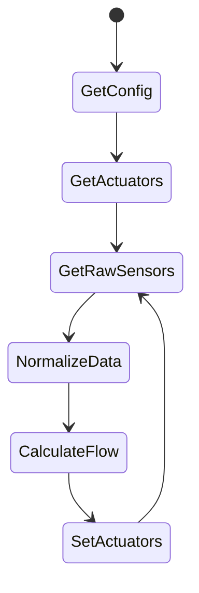

# Solar Controller

## RUN

```shell
docker run -d \
  --name solar \
  -v "/etc/localtime:/etc/localtime:ro" \
  -v "/srv/config/solar.yaml:/config.yaml:ro" \
  --log-driver "json-file" \
  --log-opt max-file="5" \
  --log-opt max-size="10m" \
  --restart "unless-stopped" \
  --network "host" \
  -h "home" \
  automatedhome/solar:0.4.0
  --homeassistant-token="<token>"
```

## Program flow

